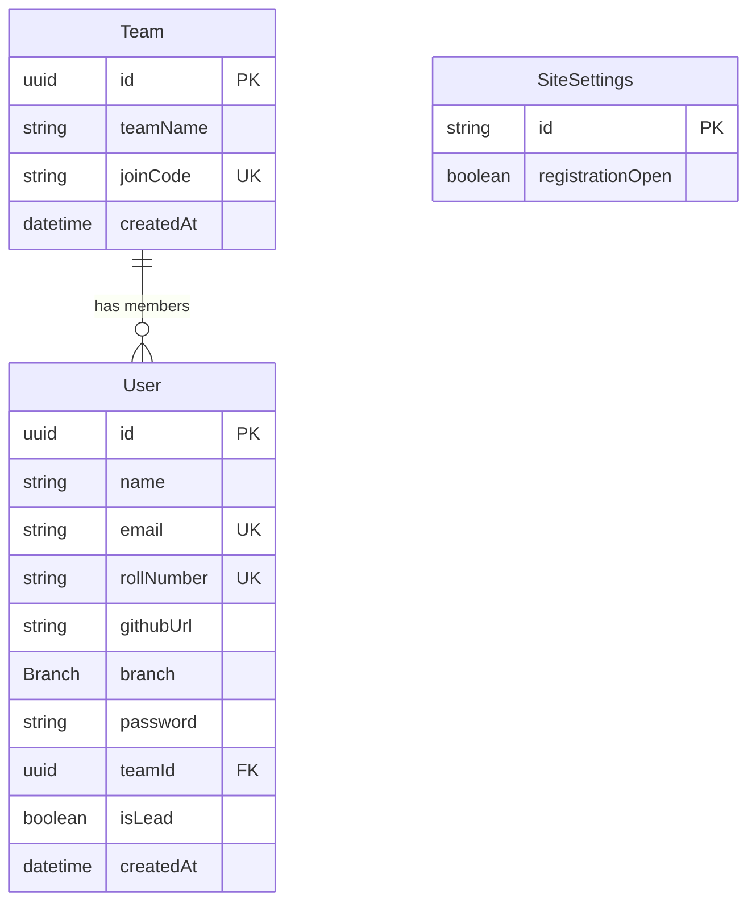

## Overview

The Coders 2029 hackathon site uses **PostgreSQL** with **Prisma ORM** to manage team registrations, user accounts, and site settings. The schema is designed to support team-based hackathon participation with flexible member management.

## Schema Location

The complete schema definition is located at:
```
prisma/schema.prisma
```

## Architecture

The database consists of three core models:

<CardGroup cols={3}>
  <Card title="Team" icon="users">
    Represents hackathon teams with unique join codes
  </Card>
  <Card title="User" icon="user">
    Individual participants with authentication and profile data
  </Card>
  <Card title="SiteSettings" icon="gear">
    Global configuration for registration control
  </Card>
</CardGroup>

## Entity Relationship Diagram



## Relationships

<AccordionGroup>
  <Accordion title="Team → User (One-to-Many)">
    A **Team** can have multiple **Users** as members (up to 3 members per team).
    
    - Foreign key: `User.teamId` → `Team.id`
    - Delete behavior: `SetNull` (if team is deleted, users remain but `teamId` becomes null)
    - Optional relationship: Users can exist without being on a team
  </Accordion>
</AccordionGroup>

## Enums

### Branch

Represents the engineering branch/department of each user.

```prisma
enum Branch {
  CE
  CSE
  EXTC
}
```

<ParamField body="Values">
  - **CE** — Computer Engineering
  - **CSE** — Computer Science Engineering
  - **EXTC** — Electronics and Telecommunication Engineering
</ParamField>

## Complete Schema

<Accordion title="View Full Prisma Schema">
```prisma
generator client {
  provider = "prisma-client-js"
}

datasource db {
  provider = "postgresql"
}

enum Branch {
  CE
  CSE
  EXTC
}

model Team {
  id        String   @id @default(uuid()) @db.Uuid
  teamName  String   @map("team_name")
  joinCode  String   @unique @map("join_code")
  createdAt DateTime @default(now()) @map("created_at") @db.Timestamptz
  members   User[]

  @@index([joinCode])
  @@map("teams")
}

model User {
  id         String   @id @default(uuid()) @db.Uuid
  name       String
  email      String   @unique
  rollNumber String   @unique @map("roll_number")
  githubUrl  String   @map("github_url")
  branch     Branch
  password   String
  teamId     String?  @map("team_id") @db.Uuid
  isLead     Boolean  @default(false) @map("is_lead")
  createdAt  DateTime @default(now()) @map("created_at") @db.Timestamptz
  team       Team?    @relation(fields: [teamId], references: [id], onDelete: SetNull)

  @@map("users")
}

model SiteSettings {
  id                  String  @id @default("singleton")
  registrationOpen    Boolean @default(true) @map("registration_open")

  @@map("site_settings")
}
```
</Accordion>

## Database Provider

<Note>
  The schema uses **PostgreSQL** as the database provider. Ensure your `POSTGRES_URL` environment variable is configured correctly.
</Note>

## Key Design Decisions

<CardGroup cols={2}>
  <Card title="UUID Primary Keys" icon="fingerprint">
    All models use UUID v4 for primary keys, providing globally unique identifiers without coordination
  </Card>
  <Card title="Soft Relationships" icon="link-slash">
    User-Team relationship uses `SetNull` on delete, preserving user data even when teams are removed
  </Card>
  <Card title="Snake Case Mapping" icon="database">
    Prisma fields use camelCase while database columns use snake_case via `@map`
  </Card>
  <Card title="Timezone-Aware Timestamps" icon="clock">
    Timestamps use `@db.Timestamptz` for proper timezone handling
  </Card>
</CardGroup>

## Next Steps

<CardGroup cols={2}>
  <Card title="Model Details" icon="book" href="/api/models">
    Detailed documentation of each model's fields and constraints
  </Card>
  <Card title="Prisma Client" icon="code">
    Learn how to query these models using Prisma Client in your application
  </Card>
</CardGroup>