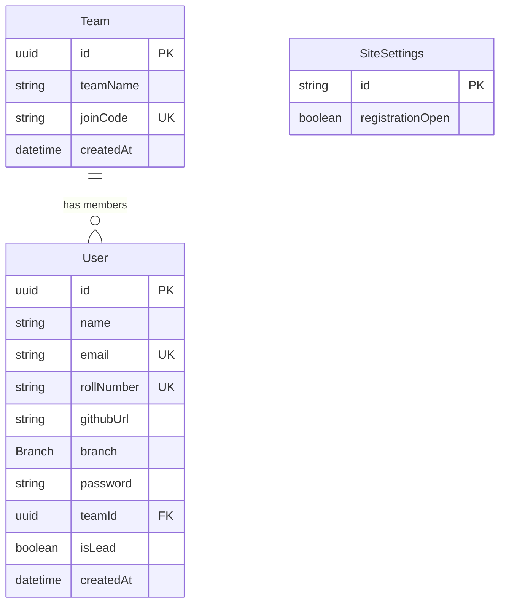

The Coders 2029 Hackathon Site uses **PostgreSQL** as the database and **Prisma ORM** for type-safe database access.

## Database Schema

The application uses three main models to manage hackathon registrations:

### Models Overview

<CardGroup cols={3}>
  <Card title="Team" icon="users">
    Represents hackathon teams with up to 3 members
  </Card>
  <Card title="User" icon="user">
    Individual participants with their details
  </Card>
  <Card title="SiteSettings" icon="gear">
    Global configuration for registration status
  </Card>
</CardGroup>

### Entity Relationship Diagram



### Team Model

Stores information about hackathon teams.

```prisma
model Team {
  id        String   @id @default(uuid()) @db.Uuid
  teamName  String   @map("team_name")
  joinCode  String   @unique @map("join_code")
  createdAt DateTime @default(now()) @map("created_at") @db.Timestamptz
  members   User[]

  @@index([joinCode])
  @@map("teams")
}
```

**Key Features:**
- `joinCode`: Unique 6-character code for team members to join
- `members`: Relation to User model (one-to-many)
- Index on `joinCode` for fast lookups

### User Model

Stores participant information and team membership.

```prisma
model User {
  id         String   @id @default(uuid()) @db.Uuid
  name       String
  email      String   @unique
  rollNumber String   @unique @map("roll_number")
  githubUrl  String   @map("github_url")
  branch     Branch
  password   String
  teamId     String?  @map("team_id") @db.Uuid
  isLead     Boolean  @default(false) @map("is_lead")
  createdAt  DateTime @default(now()) @map("created_at") @db.Timestamptz
  team       Team?    @relation(fields: [teamId], references: [id], onDelete: SetNull)

  @@map("users")
}
```

**Key Features:**
- Unique constraints on `email` and `rollNumber`
- `branch`: Enum with values `CE`, `CSE`, `EXTC`
- `isLead`: Marks the team creator/leader
- `teamId`: Optional foreign key (nullable for users without teams)
- `onDelete: SetNull`: When a team is deleted, users' `teamId` becomes null

### Branch Enum

Defines the available engineering branches:

```prisma
enum Branch {
  CE    // Computer Engineering
  CSE   // Computer Science & Engineering
  EXTC  // Electronics & Telecommunication
}
```

### SiteSettings Model

Singleton model for global configuration.

```prisma
model SiteSettings {
  id                  String  @id @default("singleton")
  registrationOpen    Boolean @default(true) @map("registration_open")

  @@map("site_settings")
}
```

**Key Features:**
- Singleton pattern: Only one row with `id = "singleton"`
- Controls whether new registrations are allowed
- Managed through the admin dashboard

## Prisma Client Usage

The application uses a singleton Prisma Client instance for database operations.

### Prisma Client Setup

Location: `lib/db/prisma.ts`

```typescript
import { PrismaClient } from "@prisma/client";
import { PrismaPg } from "@prisma/adapter-pg";

const adapter = new PrismaPg({ 
  connectionString: process.env.POSTGRES_URL 
});

const prisma = new PrismaClient({ adapter });

export { prisma };
```

<Note>
  The project uses `@prisma/adapter-pg` for connection pooling and better performance with PostgreSQL.
</Note>

### Common Queries

Here are some examples of database operations used in the application:

<CodeGroup>
```typescript User Registration
// Create a new user
const user = await prisma.user.create({
  data: {
    name: "John Doe",
    email: "john@example.com",
    rollNumber: "2023001",
    githubUrl: "https://github.com/johndoe",
    branch: "CSE",
    password: hashedPassword,
  },
});
```

```typescript Create Team
// Create a team with a leader
const team = await prisma.team.create({
  data: {
    teamName: "Code Warriors",
    joinCode: generateCode(), // 6-char unique code
  },
});

// Update user to be team leader
await prisma.user.update({
  where: { id: userId },
  data: { 
    teamId: team.id, 
    isLead: true 
  },
});
```

```typescript Join Team
// Join existing team by code
await prisma.user.update({
  where: { id: userId },
  data: { 
    teamId: team.id,
    isLead: false 
  },
});
```

```typescript Get Team with Members
// Fetch team with all members
const team = await prisma.team.findUnique({
  where: { joinCode: "ABC123" },
  include: {
    members: {
      select: {
        name: true,
        email: true,
        branch: true,
        isLead: true,
      },
      orderBy: { isLead: "desc" },
    },
  },
});
```
</CodeGroup>

## Database Migrations

Prisma Migrate is used to manage database schema changes.

### Creating Migrations

When you modify `prisma/schema.prisma`, create a migration:

```bash
npm run db:migrate
```

This will:
1. Generate SQL migration files in `prisma/migrations/`
2. Apply the migration to your database
3. Regenerate the Prisma Client

<Warning>
  Always review generated migration files before applying them to production.
</Warning>

### Migration Files

Migrations are stored in `prisma/migrations/` with timestamps:

```
prisma/migrations/
├── 20240115_init/
│   └── migration.sql
├── 20240116_add_github/
│   └── migration.sql
└── migration_lock.toml
```

### Push Schema (Development Only)

For rapid prototyping without creating migration files:

```bash
npm run db:push
```

<Warning>
  `db:push` should only be used in development. Always use `db:migrate` for production changes.
</Warning>

## Prisma Studio

Prisma Studio is a visual database browser for viewing and editing data.

### Launch Studio

```bash
npm run db:studio
```

This opens a web interface at [http://localhost:5555](http://localhost:5555) where you can:

- Browse all tables and records
- Filter and search data
- Create, update, and delete records
- View relationships between models

<Note>
  Prisma Studio is useful during development for inspecting data without writing SQL queries.
</Note>

## Database Seeding

The project includes a seed script for populating test data.

### Run Seed Script

```bash
npm run db:seed
```

This executes the seed file defined in `package.json` (typically `prisma/seed.ts`).

<Accordion title="Example Seed Data">
  A typical seed script might create:
  - Sample users across different branches
  - A few test teams with members
  - Initial `SiteSettings` configuration
</Accordion>

## Best Practices

<CardGroup cols={2}>
  <Card title="Type Safety" icon="shield-check">
    Prisma generates TypeScript types automatically. Always use the generated types instead of defining your own.
  </Card>
  <Card title="Error Handling" icon="triangle-exclamation">
    Wrap database operations in try-catch blocks and handle Prisma-specific errors like unique constraint violations.
  </Card>
  <Card title="Connection Pooling" icon="network-wired">
    The project uses `@prisma/adapter-pg` for efficient connection management with PostgreSQL.
  </Card>
  <Card title="Migrations" icon="code-branch">
    Always create migrations for schema changes. Never modify the database schema directly in production.
  </Card>
</CardGroup>

## Common Database Operations

### Check Database Status

Verify your database connection:

```bash
prisma db pull
```

### Reset Database

Drop and recreate the database with all migrations:

```bash
prisma migrate reset
```

<Warning>
  This command will delete ALL data. Only use in development.
</Warning>

### Generate Prisma Client

Regenerate the Prisma Client after schema changes:

```bash
prisma generate
```

This happens automatically during `npm install` via the postinstall hook.

## Next Steps

<CardGroup cols={2}>
  <Card title="Environment Variables" icon="key" href="/development/environment-variables">
    Learn how to configure database connection strings
  </Card>
  <Card title="NPM Scripts" icon="terminal" href="/development/scripts">
    Explore all available database management commands
  </Card>
</CardGroup>